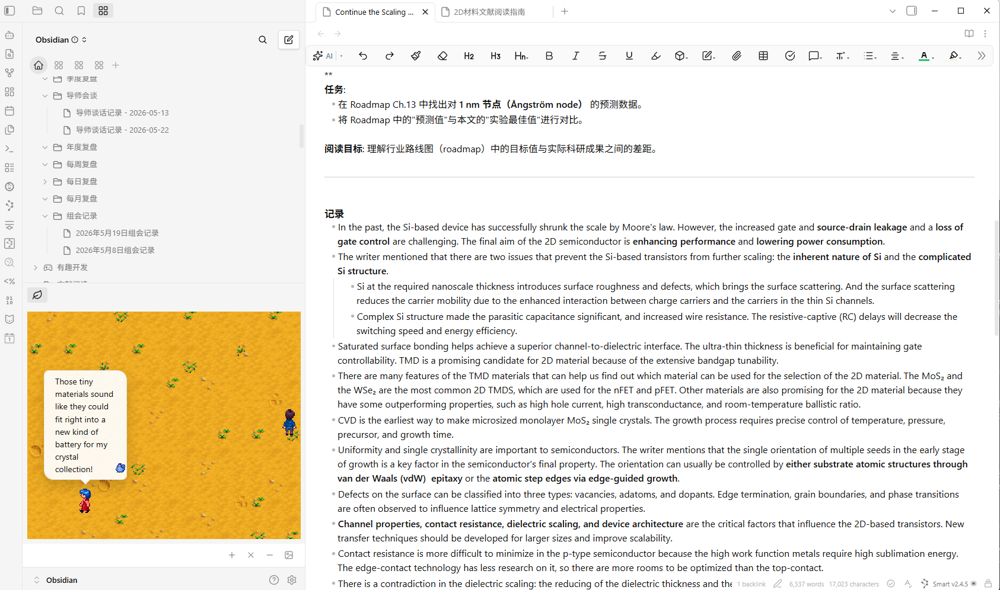

# Stardew Valley in Obsidian

Bring the charming world of Stardew Valley into your Obsidian vault. Adopt pets, befriend NPCs, and let them keep you company while you work on your notes.

## About This Plugin

This plugin is built on top of [obsidian-pets](https://github.com/hiden2000/obsidian-pets) by hiden2000, with animation logic adapted from [stardew-pet-farm](https://github.com/PROF0UND/stardew-pet-farm) by PROF0UND. It extends the original with Stardew Valley characters, AI-powered speech bubbles, expanded NPC interactions, and a redesigned settings system.

## Features

### Pets & NPCs

- **11 pet species** with 55+ color variants: cats, dogs, chickens, cows, ducks, rabbits, dinosaurs, parrots, junimos, raccoons, and turtles — each with idle, walk, special, and sleep animations
- **35 Stardew Valley NPCs** including Abigail, Sebastian, Lewis, Robin, and more — each with their own walking animations and personality
- All sprites use authentic Stardew Valley pixel art

### Display Modes

- **Panel mode**: Pets live in a resizable panel you can dock anywhere in your workspace
- **Overlay mode**: Pets roam freely across your entire Obsidian window
- Drag pets to reposition them, or let them wander on their own
- Click a pet to show a heart, right-click to trigger a speech bubble

### AI-Powered Speech Bubbles

Pets and NPCs can comment on your notes using AI, with configurable persona-based responses:

- **Right-click** a pet to get a contextual comment about your current note
- **Auto-rant mode**: Pets periodically speak up on their own at random intervals
- Supports **OpenAI**, **Google Gemini**, **DeepSeek**, and **Alibaba Bailian** (any OpenAI-compatible API)
- Each species and NPC has a unique personality that shapes their dialogue
- Optional Chinese-language prompt mode for all AI interactions

### Backgrounds

9 themed backgrounds inspired by Stardew Valley seasons and locations:

| Background | Style |
|---|---|
| None | Clean, no background |
| Dirt | Farm soil |
| Grass | Lush green field |
| Grass (Fall) | Autumn grassland |
| Sand | Beach / desert |
| Snow | Winter landscape |
| Wood (Broken) | Weathered planks (tiled) |
| Wood (Dark) | Dark timber (tiled) |
| Wood (Light) | Light planks (tiled) |
| Wood (Orange) | Warm wood (tiled) |

## Installation

### From Community Plugins (Recommended)

1. Open Obsidian and go to **Settings > Community Plugins**
2. Click **Browse** and search for **"Stardew Valley in Obsidian"**
3. Click **Install**, then **Enable**

### Manual Installation

1. Download the latest release from the [Releases page](https://github.com/miaowuduck/stardew-valley-pals/releases)
2. Extract the folder into your vault's `.obsidian/plugins/` directory
3. In Obsidian, go to **Settings > Community Plugins** and click **Reload plugins**
4. Enable **Stardew Valley in Obsidian**

## Getting Started

1. Enable the plugin — a welcome notice will guide you on first launch
2. Use the **"Add a pet"** command (or click the `+` button in the pet panel) to choose a species and give it a name
3. The pet panel will open automatically — your new friend will start wandering around
4. Use **"Choose pet view background"** to set the scene
5. (Optional) Configure AI speech in **Settings** to let your pets talk

Click the cat ribbon icon to toggle the pet view on and off.

## Commands

| Command | Description |
|---|---|
| `Add a pet` | Choose a species/NPC and name it |
| `Remove a specific pet` | Pick a pet to remove from the list |
| `Remove all pets` | Clear all pets at once |
| `Choose pet view background` | Change the background scene |

## Settings

### Display

| Setting | Description | Default |
|---|---|---|
| Overlay mode | Full-window transparent overlay vs side panel | Off |
| Background | Scene behind pets (panel mode only) | None |
| Pet size | Scale pets from 0.5x to 3.0x | 1.0x |
| Movement speed | How fast pets wander (0.5x to 3.0x) | 1.0x |

### AI Chat Configuration

| Setting | Description | Default |
|---|---|---|
| API key | OpenAI-compatible API key (masked in UI) | — |
| API endpoint | Base URL for the chat provider | `https://api.openai.com/v1` |
| Chat model | Model name (e.g. `gpt-4o-mini`, `gemini-2.5-flash`) | `gpt-5-mini` |
| Chinese prompt | Use Chinese-language AI prompts | Off |
| Test connection | Verify API credentials with a minimal request | — |

### Speech Bubbles

| Setting | Description | Default |
|---|---|---|
| Pet speech bubbles | Enable speech for regular pets | On |
| NPC speech bubbles | Enable speech for NPCs | On |

### Random Page Rant

| Setting | Description | Default |
|---|---|---|
| Random page rants | Enable periodic auto-speech | Off |
| Only rant when focused | Suppress rants when Obsidian is in the background | On |
| Rant interval (min) | Minimum time between rants | 5 min |
| Rant interval (max) | Maximum time between rants | 20 min |
| Page context length | Characters of note content sent as AI context | 1200 chars |

A **Reset to defaults** button is available at the bottom of the settings tab.

## AI Setup

To enable speech bubbles, configure an API provider in settings:

1. Get an API key from your preferred provider:
   - [OpenAI](https://platform.openai.com/api-keys)
   - [Google Gemini](https://aistudio.google.com/)
   - [DeepSeek](https://api-docs.deepseek.com/)
   - [Alibaba Bailian](https://bailian.console.aliyun.com/)
2. Set the **API endpoint** (the "Use Gemini URL" button pre-fills the Gemini-compatible endpoint)
3. Enter the **chat model** name for your provider
4. Click **Test connection** to verify everything works
5. Enable pet/NPC speech bubbles and optionally random page rants

Pets will now comment in-character on your notes based on their species personality.

## Credits

### Origin Projects
- [stardew-pet-farm](https://github.com/PROF0UND/stardew-pet-farm) — Original Stardew Valley pet concept and sprites
- [obsidian-pets](https://github.com/hiden2000/obsidian-pets) — Original Obsidian plugin implementation

### Art Assets
All pet sprites, NPC character sprites, and background images are sourced from [StardewValley-Assets](https://github.com/Huu-Yuu/StardewValley-Assets) by Huu-Yuu, which provides extracted Stardew Valley game assets.

### Inspiration
- [vscode-pets](https://marketplace.visualstudio.com/items?itemName=tonybaloney.vscode-pets) — The original VSCode pets extension

## License

MIT — see [LICENSE](LICENSE) for details.

## Feedback

Found a bug or have a suggestion? Open an issue on [GitHub](https://github.com/miaowuduck/stardew-valley-pals/issues).
