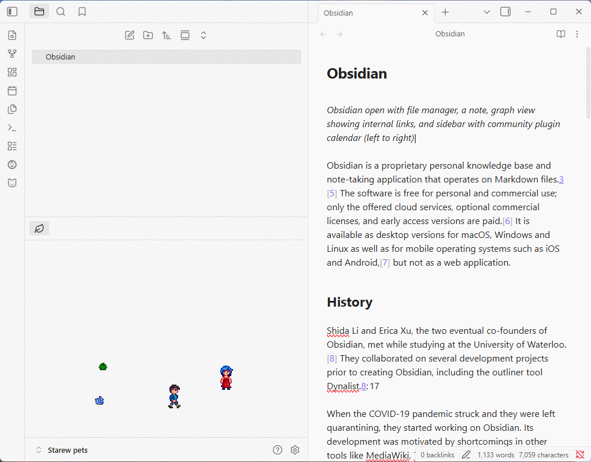
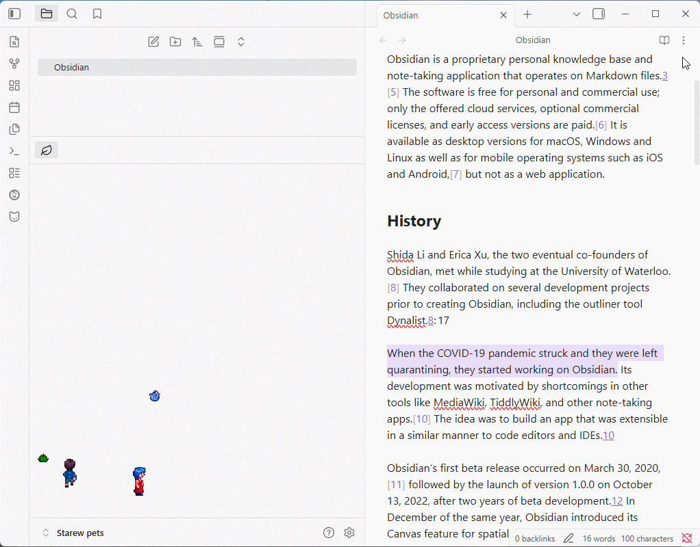
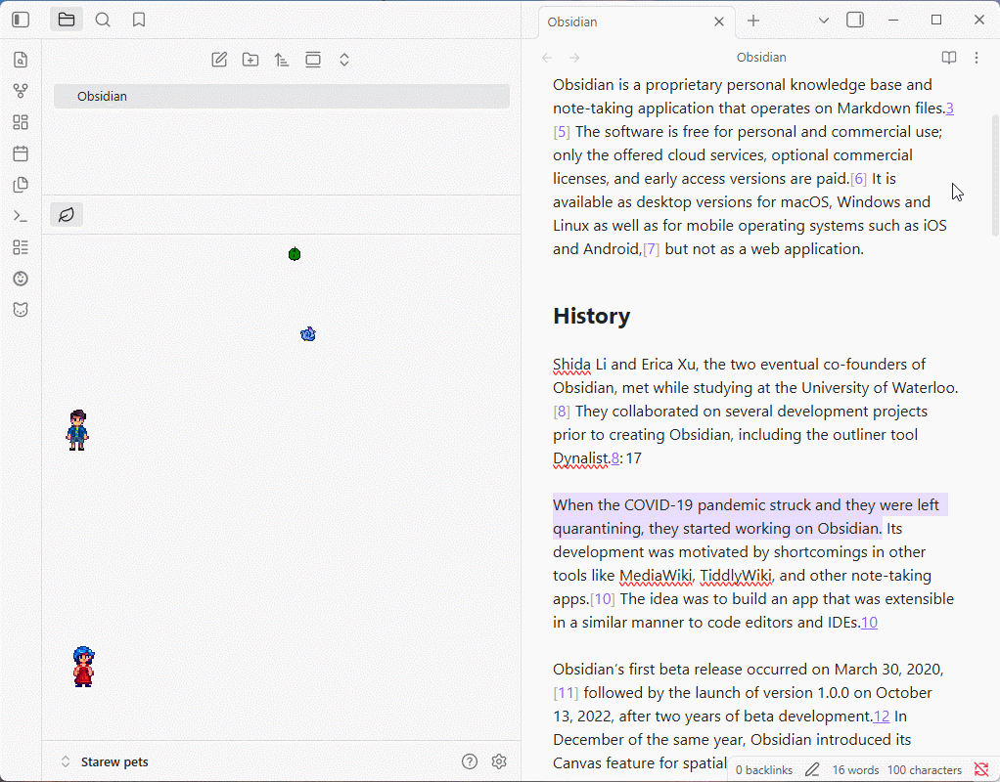
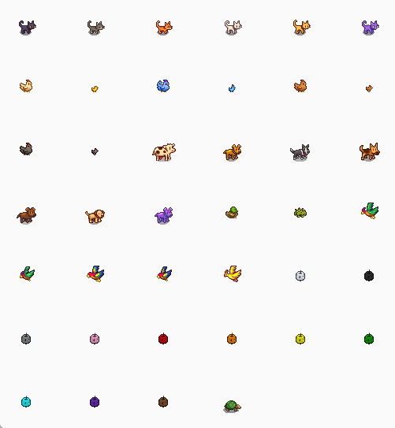
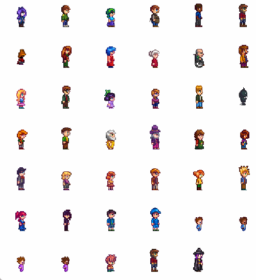

# 🐾 Stardew Valley Pals

[](https://opensource.org/licenses/MIT)
[](https://obsidian.md)

Bring the charming world of **Stardew Valley** into your Obsidian vault. Adopt adorable pets, befriend iconic villagers, and let them keep you company while you work on your notes — they'll comment on your writing, chat with each other, and even remember what matters to you.

---

## 📸 Demo

### Pets and Villagers in Action

*① Pets wandering around, idling, and sleeping in your vault.*

*② Stardew Valley villagers walking and interacting with your notes.*

 

### AI Speech Bubbles

*③ Right-click a villager to get a contextual comment about your current note.*



### Overlay Mode

*④ Pets roaming freely across your entire Obsidian window.*



---

## ✨ Features

### 🐱 Pets & 👥 Villagers



| Category | Details |
|---|---|
| **Pets** | 15 pet species with 55+ color variants — cats, dogs, chickens, cows, ducks, rabbits, dinosaurs, parrots, junimos, turtles, goats, sheep, pigs, ostriches, and raccoons. Name them whatever you like and adopt as many as you want |
| **Villagers** | 35+ Stardew Valley characters — Abigail, Sebastian, Lewis, Robin, Emily, Shane, and many more. Each villager is **one of a kind** and keeps their official name, just like in the game |
| **Animations** | Each character has idle, walk, special, and sleep animation frames |
| **Art Style** | All sprites use authentic Stardew Valley pixel art |

### 🕰️ Villager Visits (Schedule Mode)

Don't feel like managing villagers by hand? Turn on **Scheduled visits** and Pelican Town comes to you:

- Every villager keeps their own **Stardew-style daily schedule** — Willy shows up at dawn, Gus around noon, Sebastian in the late afternoon
- The roster is stable within a day and **rotates daily**, so there's always someone new to meet
- Choose how many villagers can be in town at once (1–6)
- Pets are unaffected — your animals stay right where they are

### 💬 Villager Conversations

Two villagers in town will occasionally **walk up to each other, face off, and strike up a conversation** — generated by AI from their personalities, your current note, and what they remember about you. Nearby animals gather around to watch (silently, of course).

### 🧠 Core Memories

Villagers pay attention. After speaking, a villager may distill a **durable fact about you** — that you're writing a novel, studying for an exam, learning Japanese — and remember it in future conversations. Every villager keeps their own memory (up to 10 entries each), and you can review or clear them anytime in settings.

### 🖥️ Display Modes

- **Panel mode**: Companions live in a resizable side panel dockable anywhere in your workspace
- **Overlay mode**: Companions roam freely across your entire Obsidian window as a transparent overlay
- **Interaction**: Click a pet to see a heart ❤️, right-click a villager to trigger an AI speech bubble
- **Drag & Drop**: Reposition pets manually or let them wander on their own

### 🤖 AI-Powered Speech Bubbles

Villagers comment on your notes using AI, with authentic in-game voices:

- **Right-click** a villager to get a contextual comment about your current note
- **Auto-rant mode**: Villagers periodically speak up on their own at random intervals
- Supports any **OpenAI-compatible API** (OpenAI, Google Gemini, DeepSeek, and more)
- Each villager has a unique personality and voice that shapes their dialogue — Sebastian mutters like a coder at 3 AM, Evelyn fusses over you with cookies
- Optional Chinese-language prompt mode for all AI interactions
- Animals never talk — they express themselves with hearts, animations, and enthusiastic spectating

---

## 📦 Installation

### Method 1: Community Plugins (Recommended)

1. Open Obsidian and go to **Settings → Community Plugins**
2. Ensure **Restricted Mode** is turned off
3. Click **Browse** and search for **"Stardew Valley Pals"**
4. Click **Install**, then **Enable**
5. You're all set! Use the **"Add a pet"** command to get started

### Method 2: BRAT (Beta Reviewer's Auto-update Tester)

> BRAT lets you install plugins that are not yet in the community plugin store, and automatically checks for updates.

1. Install the **BRAT** plugin from the Community Plugins store
2. Open **Settings → BRAT → Beta Plugin List**
3. Click **Add Beta Plugin**
4. Enter the repository URL:
   ```
   https://github.com/miaowuduck/stardew-valley-pals
   ```
5. BRAT will install the plugin — go to **Settings → Community Plugins** and enable **Stardew Valley Pals**
6. To update, run the **BRAT: Update all plugins and themes** command

### Method 3: Manual Installation

1. Download the latest release from the [Releases page](https://github.com/miaowuduck/stardew-valley-pals/releases)
2. Extract the folder into your vault's `.obsidian/plugins/` directory
3. Restart Obsidian (or go to **Settings → Community Plugins** and click **Reload plugins**)
4. Enable **Stardew Valley Pals**

---

## 🚀 Getting Started

1. Enable the plugin — a welcome notice will guide you on first launch
2. Use the **"Add a pet"** command, the `+` button in the pet panel, or the **Pet Management** section in settings to choose a companion
3. The pet panel opens automatically — your new friend will start wandering around
4. Manage your pets anytime in **Settings → Pet Management** — add, view, or remove pets from one place
5. (Optional) Turn on **Scheduled visits** in **Settings → Villager Visits** to let villagers drop by on their own
6. (Optional) Configure AI speech in **Settings** to let your villagers talk

Click the 🐱 ribbon icon in the left sidebar to toggle the pet view on and off.

---

## ⌨️ Commands

| Command | Description |
|---|---|
| `Add a pet` | Choose a pet or villager (pets can be named; villagers are unique) |
| `Remove a specific pet` | Pick a pet to remove from the list |
| `Remove all pets` | Clear all pets at once |

---

## ⚙️ Settings

### Display

| Setting | Description | Default |
|---|---|---|
| Overlay mode | Full-window transparent overlay vs side panel | Off |
| Pet size | Scale pets from 0.5x to 3.0x | 1.0x |
| Movement speed | How fast pets wander (0.5x to 3.0x) | 1.0x |

### Pet Management

| Setting | Description |
|---|---|
| Current pets | View all your companions with their names and species, remove any of them with one click |
| Add a new pet | Opens the selector — free-form pets plus one-of-a-kind villagers |

### Villager Visits

| Setting | Description | Default |
|---|---|---|
| Scheduled visits | Villagers arrive/leave on their own daily schedule (replaces manual villager management) | Off |
| Max visitors | How many villagers can be in town at once | 3 |
| Currently in town | Read-only list of who's visiting right now | — |

### AI Configuration

| Setting | Description | Default |
|---|---|---|
| API key | OpenAI-compatible API key (masked in UI) | — |
| API endpoint | Base URL for the AI provider | `https://api.openai.com/v1` |
| Model | Model name (e.g. `gpt-4o-mini`, `gemini-2.5-flash`) | `gpt-5-mini` |
| Chinese prompt | Use Chinese-language AI prompts | Off |
| Test connection | Verify API credentials with a minimal request | — |

### Speech Bubbles

| Setting | Description | Default |
|---|---|---|
| NPC speech | Allow villagers to show speech bubbles | On |
| Villager conversations | Let two villagers walk up and chat with each other | On |

### Villager Memory

| Setting | Description | Default |
|---|---|---|
| Core memories | Villagers distill durable facts about you and remember them | On |
| Per-villager entries | Review what each villager remembers; clear individually or all at once | — |

### Random Page Rant

| Setting | Description | Default |
|---|---|---|
| Random page rants | Enable periodic auto-speech | Off |
| Only rant when focused | Suppress rants when Obsidian is in the background | On |
| Rant interval (min) | Minimum time between rants | 5 min |
| Rant interval (max) | Maximum time between rants | 20 min |
| Page context length | Characters of note content sent as AI context | 1200 chars |

A **Reset to defaults** button is available at the bottom of the settings tab.

---

## 🔧 AI Setup

To enable speech bubbles, configure an API provider in settings:

1. Get an API key from your preferred provider:
   - [OpenAI](https://platform.openai.com/api-keys)
   - [Google Gemini](https://aistudio.google.com/)
   - [DeepSeek](https://api-docs.deepseek.com/)
2. Set the **API endpoint** (e.g. `https://api.openai.com/v1` for OpenAI, or `https://generativelanguage.googleapis.com/v1beta/openai/` for Gemini)
3. Enter the **model** name for your provider
4. Click **Test connection** to verify everything works
5. Enable NPC speech bubbles and optionally random page rants

Villagers will now comment in-character on your notes — and remember what they learn about you.

---

## 🙏 Credits

### Origin Projects
- [stardew-pet-farm](https://github.com/PROF0UND/stardew-pet-farm) — Original Stardew Valley pet concept and sprites
- [obsidian-pets](https://github.com/hiden2000/obsidian-pets) — Original Obsidian plugin implementation

### Art Assets
All pet sprites, villager character sprites, and images are sourced from [StardewValley-Assets](https://github.com/Huu-Yuu/StardewValley-Assets) by Huu-Yuu, which provides extracted Stardew Valley game assets.

### Inspiration
- [vscode-pets](https://marketplace.visualstudio.com/items?itemName=tonybaloney.vscode-pets) — The original VSCode pets extension

---

## 📄 License

MIT — see [LICENSE](LICENSE) for details.

---

## 💬 Feedback

Found a bug or have a suggestion? Open an issue on [GitHub](https://github.com/miaowuduck/stardew-valley-pals/issues).

---

*Made with ❤️ for Stardew Valley fans and Obsidian users alike.*
